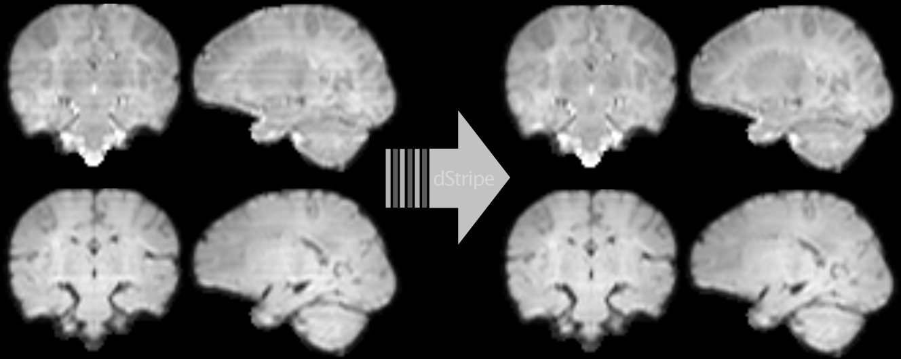

# dStripe: slice artefact correction in diffusion MRI

This repository contains code and model weights for the method described in the paper
"**dStripe: slice artefact correction in diffusion MRI via constrained neural network**" by
Maximilian Pietsch, Daan Christiaens, Joseph V Hajnal, J-Donald Tournier, published in 
Medical Image Analysis, 2021, 102255, https://doi.org/10.1016/j.media.2021.102255.

Abstract: MRI scanner and sequence imperfections and advances in reconstruction and imaging techniques to increase motion robustness can lead to inter-slice intensity variations in Echo Planar Imaging. Leveraging deep convolutional neural networks as universal image filters, we present a data-driven method for the correction of acquisition artefacts that manifest as inter-slice inconsistencies, regardless of their origin. This technique can be applied to motion- and dropout-artefacted data by embedding it in a reconstruction pipeline. The network is trained in the absence of ground-truth data on, and finally applied to, the reconstructed multi-shell high angular resolution diffusion imaging signal to produce a corrective slice intensity modulation field. This correction can be performed in either motion-corrected or scattered source-space. We focus on gaining control over the learned filter and the image data consistency via built-in spatial frequency and intensity constraints. The end product is a corrected image reconstructed from the original raw data, modulated by a multiplicative field that can be inspected and verified to match the expected features of the artefact. In-plane, the correction approximately preserves the contrast of the diffusion signal and throughout the image series, it reduces inter-slice inconsistencies within and across subjects without biasing the data. We apply our pipeline to enhance the super-resolution reconstruction of neonatal multi-shell high angular resolution data as acquired in the developing Human Connectome Project.

Keywords: diffusion MRI; image artefact removal; venetian blind artefact

This repository is set up as a module to [MRtrix3](https://www.mrtrix.org/) and uses pytorch and a number of other python packages (see [environment.yml](environment.yml)).

# Usage for anatomical-space inference

For ease of use, we recommend using Docker as outlined below. dStripe supports CPU-only and single and multi-GPU usage. In the usage examples, input and output data are located in `~/data` and mapped to `/data` inside the Docker container. This can be adjusted by modifying the command line option `--volume ~/data/:/data`.

## get build image

### get it from dockerhub 


```bash
docker pull maxpietsch/dstripe:0.1
```

If you use the dockerhub image, please replace `dstripe` in the docker command line examples wih the `maxpietsch/dstripe:0.1`.


### or build your own docker image 

```bash
git clone git@github.com:maxpietsch/dStripe.git dStripe
cd dStripe

[ -z "$UID" ] && UID=$(id -u)
[ -z "$GID" ] && GID=$(id -g)
OSTYPE=$(uname)
docker image build \
  --build-arg username=$USER \
  --build-arg uid=$UID \
  --build-arg gid=$GID \
  --build-arg ostype=$OSTYPE \
  --file docker/Dockerfile \
  --tag dstripe \
  .
```

Make sure you have sufficient RAM! You might need to increase Docker's runtime memory ([macOS](https://docs.docker.com/docker-for-mac/#memory), [windows](https://docs.docker.com/docker-for-windows/#advanced)).

## show dwidestripe usage

The main command for inference is `dwidestripe`. To show its usage simply run it without arguments:

```bash
docker run --rm dstripe dwidestripe
```

<details><summary>which should show the usage (click me).</summary>
<p>
  
```
Version fa78d464                   dwidestripe
using MRtrix3 3.0.1

     dwidestripe: external MRtrix3 project

SYNOPSIS

     Correct slice modulation artefacts in a DWI series image

USAGE

     dwidestripe [ options ] input mask output

        input        The input diffusion MRI series

        mask         mask

        output       The output intensity modulation field

DESCRIPTION

     part of dStripe. output: multiplicative modulation field

EXAMPLE USAGES

     Compute the modulation field:
       $ dwidestripe dwi.mif field.mif

OPTIONS

  -corrected CORRECTED
     The corrected DWI image series

Options for importing the diffusion gradient table

  -grad GRAD
     Provide the diffusion gradient table in MRtrix format

  -fslgrad bvecs bvals
     Provide the diffusion gradient table in FSL bvecs/bvals format
  
Model options

  -model
     json defining model parameters, default:
     /home/mp/dStripe/models/dstripe_2019_07_03-31_v2.pth.tar.json

  -checkpoint CHECKPOINT
     load specific model checkpoint

  -device
     device: "cpu" or comma separated GPU number, default: 0

  -batch_size INT
     batch_size, default: 1

  -butterworth_samples_cutoff FLOAT
     BW filter cutoff frequency, default: 0.65625

Additional standard options for Python scripts

  -nocleanup
     do not delete intermediate files during script execution, and do not delete
     scratch directory at script completion.

  -scratch /path/to/scratch/
     manually specify the path in which to generate the scratch directory.

  -continue <ScratchDir> <LastFile>
     continue the script from a previous execution; must provide the scratch
     directory path, and the name of the last successfully-generated file.

Standard options

  -info
     display information messages.

  -quiet
     do not display information messages or progress status. Alternatively, this
     can be achieved by setting the MRTRIX_QUIET environment variable to a non-
     empty string.

  -debug
     display debugging messages.

  -force
     force overwrite of output files.

  -nthreads number
     use this number of threads in multi-threaded applications (set to 0 to
     disable multi-threading).

  -config key value  (multiple uses permitted)
     temporarily set the value of an MRtrix config file entry.

  -help
     display this information page and exit.

  -version
     display version information and exit.

AUTHOR
     Max Pietsch (maximilian.pietsch@kcl.ac.uk)

COPYRIGHT
     Copyright (c) 2008-2020 the MRtrix3 contributors.  This Source Code Form is
     subject to the terms of the Mozilla Public License, v. 2.0. If a copy of
     the MPL was not distributed with this file, You can obtain one at
     http://mozilla.org/MPL/2.0/.  Covered Software is provided under this
     License on an "as is" basis, without warranty of any kind, either
     expressed, implied, or statutory, including, without limitation, warranties
     that the Covered Software is free of defects, merchantable, fit for a
     particular purpose or non-infringing. See the Mozilla Public License v. 2.0
     for more details.  For more details, see http://www.mrtrix.org/.

REFERENCES

     Maximilian Pietsch, Daan Christiaens, Joseph V Hajnal, J-Donald Tournier,
     dStripe: slice artefact correction in diffusion MRI via constrained neural
     network Medical Image Analysis, 2021, 102255
  
     Tournier, J.-D.; Smith, R. E.; Raffelt, D.; Tabbara, R.; Dhollander, T.;
     Pietsch, M.; Christiaens, D.; Jeurissen, B.; Yeh, C.-H. & Connelly, A.
     MRtrix3: A fast, flexible and open software framework for medical image
     processing and visualisation. NeuroImage, 2019, 202, 116137

```
  
</p>
</details>


## dwidestripe ~/data/dwi.mif on the CPU (relatively slow)

```bash
docker run --rm --volume ~/data/:/data dstripe \
  dwidestripe /data/dwi.mif /data/mask.mif /data/dstripe_field.mif -device cpu
```

## dwidestripe ~/data/dwi.mif on the GPU

This should be much faster but requires the [NVIDIA Container Toolkit](https://docs.nvidia.com/datacenter/cloud-native/container-toolkit/install-guide.html). Make sure `docker run --rm --gpus all nvidia/cuda:11.0-base nvidia-smi` shows your GPUs before proceeding.
  
For [GPU support](https://docs.docker.com/config/containers/resource_constraints/) add `--gpus all` and replace `-device cpu` with for instance `-device 0,1` for using the first two CUDA-capable GPUs listed by `nvidia-smi`.

```bash
docker run --rm --volume ~/data/:/data --gpus all dstripe \
  dwidestripe /data/dwi.mif /data/mask.mif /data/dstripe_field.mif -device 0,1
```

## apply dStripe field

```bash
docker run --rm --volume ~/data/:/data dstripe \
  mrcalc /data/dwi.mif /data/dstripe_field.mif -mult /data/dwi_destriped.mif
```

## acknowledgement

```bibtex
@article{pietsch2021dStripe,
title = {dStripe: slice artefact correction in diffusion MRI via constrained neural network},
journal = {Medical Image Analysis},
pages = {102255},
year = {2021},
issn = {1361-8415},
doi = {https://doi.org/10.1016/j.media.2021.102255},
author = {Maximilian Pietsch and Daan Christiaens and Joseph V Hajnal and J-Donald Tournier}
}
```
